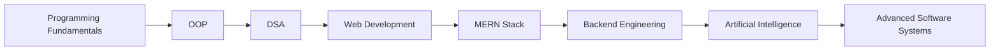

# 🚀 Zaeem Ul Hassan

# 👨‍💻 Welcome to My Developer Dashboard

### MERN Stack Developer • Node.js Developer • AI Enthusiast • Problem Solver

---

## 🎯 Developer Profile

```text
╔══════════════════════════════════════════════════════╗
║ 👋 Name      : Zaeem Ul Hassan                      ║
║ 🎓 Role      : Software Engineering Student         ║
║ 🌐 Stack     : MERN Stack Developer                 ║
║ ⚡ Backend   : Node.js & Express.js                 ║
║ 🐍 Language  : Python                               ║
║ 🤖 Interest  : Artificial Intelligence              ║
║ 📚 Focus     : DSA & OOP                            ║
║ 🚀 Goal      : Build Impactful Software Solutions   ║
╚══════════════════════════════════════════════════════╝
```

---

## 👨‍💻 About Me

> 💡 Passionate Software Engineering student dedicated to building scalable web applications, intelligent AI-powered solutions, and efficient software systems. I enjoy transforming ideas into impactful digital products through clean code, modern technologies, and continuous learning.

🌟 **Highlights**

* 🎓 Software Engineering Student
* 🌐 MERN Stack Developer
* ⚡ Node.js & Backend Development Enthusiast
* 🐍 Python Developer
* 🤖 Artificial Intelligence Enthusiast
* 📊 Data Structures & Algorithms Learner
* 🏗️ Strong Foundation in Object-Oriented Programming (OOP)
* 💡 Problem Solver & Continuous Learner
* 🚀 Passionate About Building Real-World Applications

---

## 🛠️ Tech Arsenal

### 💻 Programming Languages

```text
JavaScript  ████████████████████ 95%
Python      ██████████████████░░ 90%
C++         ████████████████░░░░ 80%
SQL         ███████████████░░░░░ 75%
```

### 🎨 Frontend Development

🔹 React.js
🔹 HTML5
🔹 CSS3
🔹 Bootstrap
🔹 Tailwind CSS

### ⚙️ Backend Development

🔹 Node.js
🔹 Express.js
🔹 RESTful APIs

### 🗄️ Databases

🔹 MongoDB
🔹 MySQL

### 📚 Core Computer Science Skills

✅ Object-Oriented Programming (OOP)
✅ Data Structures & Algorithms (DSA)
✅ Database Design
✅ Software Engineering Principles
✅ Problem Solving

### 🤖 Artificial Intelligence

✅ Artificial Intelligence Fundamentals
✅ Machine Learning Basics
✅ Prompt Engineering
✅ AI Application Development

### 🔧 Tools & Platforms

🔹 Git
🔹 GitHub
🔹 VS Code
🔹 Postman
🔹 Linux

---

## 📊 Skills Dashboard

| 🚀 Skill     | 📈 Level |
| ------------ | -------- |
| MERN Stack   | ⭐⭐⭐    |
| Node.js      | ⭐⭐⭐⭐⭐    |
| Python       | ⭐⭐⭐⭐     |
| OOP          | ⭐⭐⭐⭐    |
| DSA          | ⭐⭐⭐⭐     |
| MongoDB      | ⭐⭐⭐     |
| AI           | ⭐⭐⭐     |
| Git & GitHub | ⭐⭐⭐⭐     |

---

## 🎯 Current Focus

```text
🚀 Building Full-Stack MERN Applications
⚡ Advanced Node.js Backend Development
📚 Data Structures & Algorithms
🤖 AI-Powered Web Applications
🏗️ Scalable Software Architectures
🌍 Open Source Contributions
```

---

## 🌟 Learning Journey



---

## 📫 Connect With Me

🌐 **GitHub**
[https://github.com/yourusername](https://github.com/zaeemulhassan12)

💼 **LinkedIn**
[https://linkedin.com/in/yourprofile](https://www.linkedin.com/in/zaeem-ul-hassan-655946286/)

📧 **Email**
[zaeemulhassan819@gmail.com](mailto:zaeemulhassan819@gmail.com)

---

## 💡 Developer Motto

### ⭐ "Code. Learn. Build. Repeat."

```text
┌───────────────────────────────────────┐
│ Every expert was once a beginner.     │
│ Keep learning. Keep building. 🚀      │
└───────────────────────────────────────┘
```

---

### 🚀 Thanks for Visiting My Profile!

⭐ Don't forget to explore my repositories and projects.


