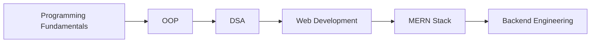

# Zaeem Ul Hassan

#  Welcome to My Developer Dashboard

### MERN Stack Developer • Applied AI • Problem Solver
## 🌐 Socials:
[]([https://discord.gg/discord.gg/7k9TCSjw](https://discord.com/users/722512390389891173)) [](https://www.instagram.com/zaeemulhassan_0/) [](https://www.instagram.com/zaeemulhassan_0?utm_source=ig_web_button_share_sheet&dlrf=ZDNlZDc0MzIxNw==) [](https://x.com/Zaeemdesign819)  [](mailto:zaeemulhassan819@gmail.com)

---

##  Developer Profile

```text
╔══════════════════════════════════════════════════════╗
║ 👋 Name      : Zaeem Ul Hassan                      ║
║ 🎓 Role      : Software Engineering Student         ║
║ 🌐 Stack     : MERN Stack Developer                 ║
║ ⚡ Backend   : Node.js & Express.js                 ║
║ 🐍 Language  : Python ,JavaScript                   ║
║ 🤖 Interest  : Artificial Intelligence              ║
║ 📚 Focus     : DSA & OOP                            ║
║ 🚀 Goal      : Build Impactful Software Solutions   ║
╚══════════════════════════════════════════════════════╝
```

---

## About Me

>  Use this updated version:

> Full-stack developer focused on  building scalable web applications, intelligent AI-powered solutions, and efficient software systems. I enjoy transforming ideas into impactful digital products through clean code, modern technologies, and continuous learning.

---

##  Tech Stack

### 💻 Programming Languages

<p align="center">
  <a href="https://skillicons.dev">
    
  </a>
</p>

### Projects
## 🚀 Featured Project
## 🌐 My Portfolio

Explore my portfolio to see my work, projects, and services.

<p>
  <a href="https://zaeemdesignpixels.rf.gd/?i=2">
    
  </a>
</p>

### 🎙️ LiveKit Voice Agent with Ollama

A voice agent built with **LiveKit** and **Ollama models** for AI-powered voice interactions.

<p>
  <a href="https://github.com/zaeemulhassan12/Ai-Agent">
    
  </a>
</p>

### 💬 Customer Support Agent

An AI-powered agent designed to assist with customer support queries.

<p>
  <a href="https://github.com/zaeemulhassan12/Customer-Support_agent">
    
  </a>
</p>

### 🧠 LeetCode Problem-Solving Portfolio

A collection of LeetCode problems I’ve solved independently. This repository reflects my practice in breaking down coding challenges and applying data structures and algorithms.

<p>
  <a href="https://github.com/zaeemulhassan12/Leetcode-Problems-Solving-By-myself">
    
  </a>
</p>


### 🤖 Artificial Intelligence

✅ Artificial Intelligence Fundamentals
✅ Machine Learning Basics
✅ Prompt Engineering
✅ Agentic Agent & Bots

---

## 📊 Skills Dashboard

| 🚀 Skill     | 📈 Level |
| ------------ | -------- |
| MERN Stack   | ⭐⭐⭐    |
| Node.js      | ⭐⭐⭐⭐⭐    |
| Python       | ⭐⭐⭐⭐     |
| OOP          | ⭐⭐⭐⭐    |
| DSA          | ⭐⭐⭐⭐     |
| MongoDB      | ⭐⭐⭐     |
| AI           | ⭐⭐⭐     |
| Git & GitHub | ⭐⭐⭐⭐     |

---

## 🎯 Current Focus

```text
🌍 Building AI agents with LangChain.
🚀 Building Full-Stack MERN Applications
⚡ Node.js Backend Development
📚 Data Structures & Algorithms
🤖 AI-Powered Web Applications
🏗️ Scalable Software Architectures

```

---

## 🌟 Learning Journey


```mermaid
graph LR
A[Programming Fundamentals] --> B[OOP]
B --> C[DSA]
C --> D[Web Development]
D --> E[MERN Stack]
E --> F[Backend Engineering]

```


## 💡 Developer Motto

### ⭐ "Code. Learn. Build. Repeat."

```text
┌───────────────────────────────────────┐
│ Every expert was once a beginner.     │
│ Keep learning. Keep building. 🚀      │
└───────────────────────────────────────┘
```

---

### 🚀 Thanks for Visiting My Profile!

